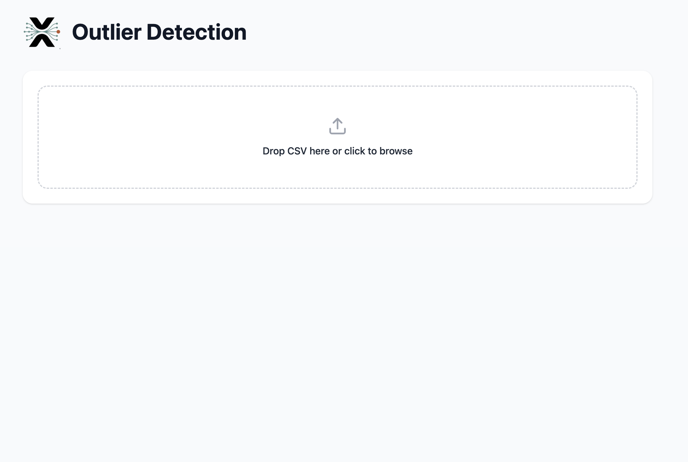
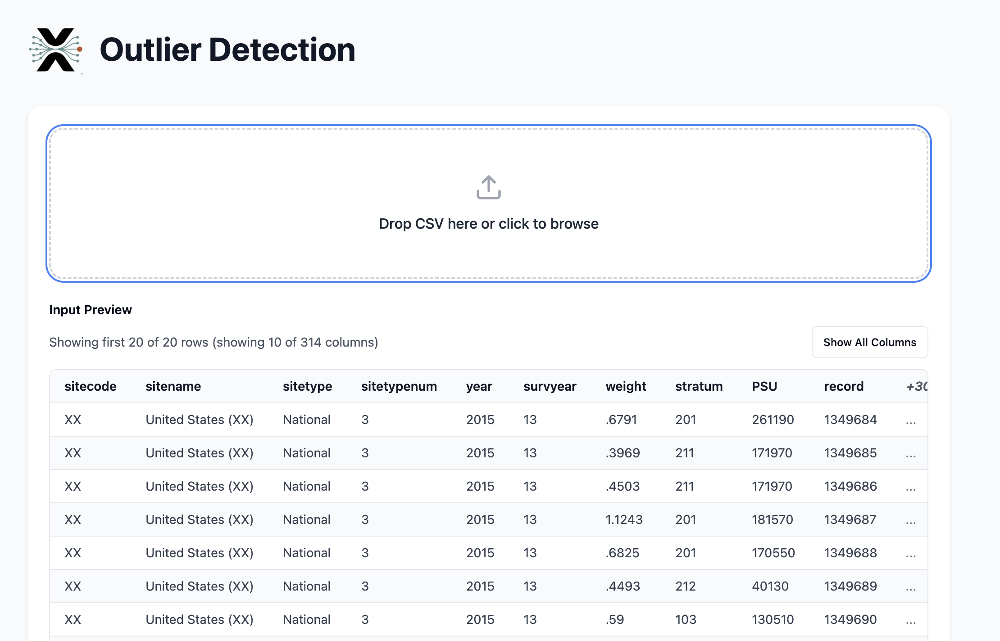
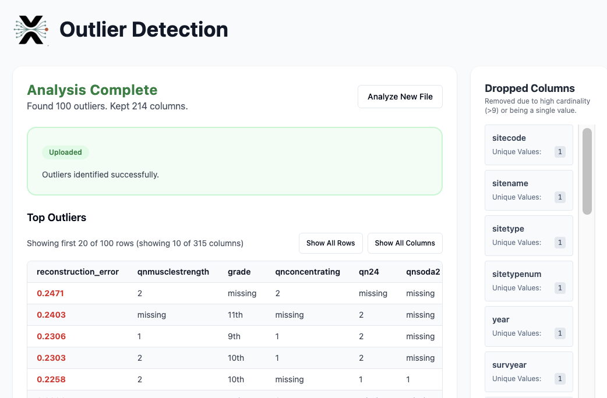

# AutoEncoder Outlier Detection Platform

A full-stack machine learning platform for detecting outliers in survey and tabular data using autoencoders. Upload your CSV data through a web interface and receive outlier analysis powered by Vertex AI.


## Overview

The pipeline consists of the following steps:

1. **data_loader** - loads the dataset and returns a processed dataframe that can then be encoded/decoded
2. **autoencoder** - sets up the architecture of the autoencoder
3. **hyperparameter_tuning** - finds the optimal parameters for the neural network
4. **measure_accuracy** - measures how well we can reconstruct each attribute of the dataset
5. **find_outliers** - examines which rows are most difficult to reconstruct (likely inattentive/mischievous participants)

## Features

- **Web-Based Upload**: Drag-and-drop CSV file upload with instant preview
- **Automatic Column Filtering**: "Rule of 9" filter - automatically selects columns with 1-9 unique values (categorical variables suitable for autoencoder analysis)
- **Cloud ML Pipeline**: Training runs on Google Cloud Vertex AI for scalable processing
- **Outlier Detection**: Identifies rows with highest reconstruction error
- **Results Visualization**: View outlier scores, dropped columns, and detailed analysis

## Screenshots

### Upload Interface


### Data Preview


### Results Display


## Tech Stack

| Layer | Technologies |
|-------|--------------|
| **Frontend** | React 18, Vite, TypeScript, Tailwind CSS, shadcn/ui |
| **API Server** | Express.js, TypeScript, Multer |
| **ML Pipeline** | Python, TensorFlow/Keras, pandas, NumPy |
| **Cloud Services** | Google Cloud Storage, Pub/Sub, Firestore, Vertex AI |

## Architecture

```
React UI → Express API → GCS → Pub/Sub → Worker → Vertex AI → Firestore → Results
```

**Data Flow:**
1. User uploads CSV through React frontend
2. Express server generates signed URL, file uploads directly to GCS
3. Job metadata saved to Firestore, message published to Pub/Sub
4. Worker receives message, triggers Vertex AI CustomContainerTrainingJob
5. Vertex AI container downloads data, trains autoencoder, computes outlier scores
6. Results written to Firestore
7. Frontend polls for completion, displays results

---

## Running the Web Interface

### Prerequisites
- Python 3.10+
- Node.js 18+
- Google Cloud SDK with authenticated service account
- GCP project with: Cloud Storage, Pub/Sub, Firestore, Vertex AI APIs enabled

### Environment Setup

**Root `.env`:**
```env
GOOGLE_APPLICATION_CREDENTIALS=/path/to/service-account-key.json
GOOGLE_CLOUD_PROJECT=your-project-id
```

**`frontend/.env`:**
```env
GOOGLE_CLOUD_PROJECT=your-project-id
GCS_BUCKET_NAME=your-bucket-name
PUBSUB_TOPIC=job-upload-topic
```

### Start Development (3 Terminals)

**Terminal 1 - Python Worker:**
```bash
source venv/bin/activate
python worker.py
```

**Terminal 2 - Express API:**
```bash
cd frontend
npm install
npm run dev:server
# Runs on http://localhost:5001
```

**Terminal 3 - React UI:**
```bash
cd frontend
npm run dev
# Runs on http://localhost:5173
```

---

## CLI Commands

The main file is `main.py`. You can run various entrypoints by choosing the appropriate arguments.

### Train model
```bash
python main.py train
```

Parameters to set:
- `--seed`: Seed for reproducibility. Default: `2`.
- `--model_name`: Model to train. Choose between two available values: `AE` for the simple autoencoder and `VAE` for a variational autoencoder.
- `--prior`: Prior to use for the variational autoencoder. Choose between two available values: `gaussian` for a Gaussian prior and `gumbel` for applying the gumbel softmax.
- `--data`: Dataset to train the model on. Default: `sadc_2017`.
- `--config`: Configuration file for the model training. This should contain the hyperparameters for the model. You can find an example of the configuration file in the `config` folder and the files that have `simple` as a prefix.
- `--output`: Output folder to save the outputs. Default: `cache/simple_model/`.

The output of this command is a trained model that can be used for evaluation and is stored in the output folder under the `autoencoder` subfolder.
Also, it generates a `.npy` file of the history as produced by the keras fit method for future use, as well as plots of training and validation losses;
Specifically, for `AE` it stores the reconstruction loss plot, whereas for `VAE` the reconstruction loss, the kl loss, as well as the total cost of these two.


### Search Hyperparameters
```bash
python main.py search_hyperparameters
```

Parameters to set:
- `--seed`: Seed for reproducibility. Default: `2`.
- `--model_name`: Model to search hyperparameters for. Choose between two available values: `AE` for the simple autoencoder and `VAE` for a variational autoencoder.
- `--prior`: Prior to use for the variational autoencoder. Choose between two available values: `gaussian` for a Gaussian prior and `gumbel` for applying the gumbel softmax.
- `--data`: Dataset to train the model on and search for hyperparameters. Default: `sadc_2017`.
- `--config`: Configuration file for the model hyperparameters searching. This should contain the hyperparameters for the model. You can find an example of the configuration file in the `config` folder and the files that have `hp` as a prefix.
- `--output`: Output folder to save the outputs. Default: `cache/simple_model/`.

The output of this command is a `yaml` file that contains the best hyperparameters found during the search. This file is stored in the output folder in a file named as `best_hyperparameters.yaml`.

### Evaluate model
```bash
python main.py evaluate
```

Parameters to set:
- `--seed`: Seed for reproducibility. Default: `2`.
- `--model_path`: Path to the trained model you have stored. It should be a folder as the one that is created during `train` command. Default: `cache/simple_model/autoencoder`.
- `--data`: Dataset to evaluate the model on. Default: `sadc_2017`.
- `--output`: Output folder to save the outputs. Default: `cache/predictions/`.

The output of this command is two `.csv` files;
One that contains the metrics as computed per variable/attribute of the data and is stored in the output folder under the name `metrics.csv`,
and one that contains the average metrics of all the variables/attributes of the data and is stored in the output folder under the name `averages.csv`.


### Find outliers
```bash
python main.py find_outliers
```

Parameters to set:
- `--seed`: Seed for reproducibility. Default: `2`.
- `--model_path`: Path to the trained model you have stored. It should be a folder as the one that is created during `train` command. Default: `cache/simple_model/autoencoder`.
- `--prior`: Prior to use for the variational autoencoder. Choose between two available values: `gaussian` for a Gaussian prior and `gumbel` for applying the gumbel softmax.
- `--data`: Dataset to evaluate the model on. Default: `sadc_2017`.
- `--k`: Weight of the kl loss in the total loss if the model is `VAE`. Default: `1`.
- `--output`: Output folder to save the outputs. Default: `cache/predictions/`.

The output of this command is a `.csv` file that contains the reconstruction loss (or reconstruction, kl, and total loss in case of `VAE`) of each row of the data and is stored in decreasing order in the output folder under the name `errors.csv`.

---

## Troubleshooting

### Dependency Version Conflicts

**google-auth version mismatch:**
```
ERROR: google-auth-oauthlib 1.2.3 requires google-auth<2.42.0
```
Fix: Remove version pins from `google-auth` and `google-auth-oauthlib` in `requirements.txt` to let pip resolve compatible versions.

**llvmlite build failure (LLVM not found):**
```
CMake Error: LLVMConfig.cmake not found
```
Fix: Install pre-built binaries:
```bash
pip install --only-binary=:all: llvmlite==0.46.0 numba==0.63.1
```

### Mac Apple Silicon (M1/M2/M3)

**TensorFlow AVX crash:**
The standard `tensorflow==2.15.1` package requires AVX instructions not available on Apple Silicon.

**For the worker (no TensorFlow needed):**
The `worker.py` script only dispatches jobs to Vertex AI - it doesn't need TensorFlow locally. Ensure no TensorFlow imports exist in `worker.py`.

**For local training:**
```bash
pip uninstall tensorflow
pip install tensorflow-macos tensorflow-metal
```

Note: Do not add `tensorflow-macos` to `requirements.txt` - it breaks the cloud build. This is for local development only.

### Wrong GCP Project

If you see errors about missing resources or permissions, verify your credentials point to the correct project:
```bash
echo $GOOGLE_APPLICATION_CREDENTIALS
cat $GOOGLE_APPLICATION_CREDENTIALS | jq .project_id
```

## Current Limitations

- **Cold Start Latency**: Vertex AI jobs take ~10-15 minutes due to container initialization
- **No Authentication**: API endpoints are unauthenticated (deploy on private network)
- **No Job Cancellation**: Cannot cancel running jobs from UI (use GCP Console)
